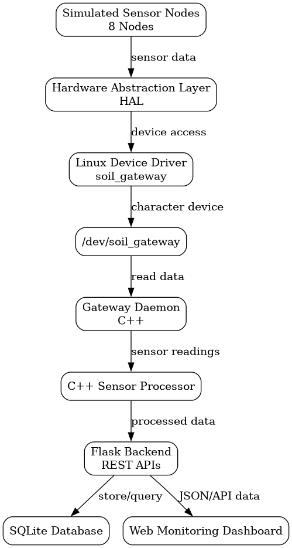

# SMART AGRICULTURAL SOIL-MOISTURE MONITORING GATEWAY

## Using Linux Device Driver, System Programming and C++

---

# 1. Project Introduction

## 1.1 Project Overview

The Smart Agricultural Soil-Moisture Monitoring Gateway is a Linux-based software prototype designed to monitor soil-moisture conditions from multiple sensor nodes.

The system demonstrates the integration of Linux device-driver development, hardware abstraction, system programming, C++, backend services, database storage and web-based monitoring.

The current prototype uses simulated sensor nodes so that the complete software architecture can be developed and tested without requiring physical agricultural sensor hardware.

## 1.2 Problem Statement

Agricultural irrigation requires information about soil conditions to avoid unnecessary watering and to identify dry areas.

A multi-node monitoring system can collect sensor information from different locations and process it through a central gateway.

The project addresses this requirement by designing a Linux-based gateway capable of processing sensor information, classifying soil conditions and providing monitoring information through a web dashboard.

## 1.3 Objectives

The main objectives are:

- Develop a Linux-based agricultural monitoring gateway.
- Demonstrate Linux device-driver interaction.
- Implement a hardware abstraction layer.
- Process sensor information using C++.
- Support multiple sensor nodes.
- Detect dry-soil conditions.
- Generate irrigation recommendations.
- Store historical sensor information.
- Provide REST APIs.
- Develop a web-based monitoring dashboard.
- Demonstrate complete system integration.

---

# 2. Scope

The project includes:

- Simulated multi-node soil-moisture sensors.
- Linux device-driver interface.
- Hardware Abstraction Layer.
- C++ gateway and sensor processing.
- Python Flask backend.
- SQLite database.
- REST API endpoints.
- Monitoring dashboard.
- Sensor analytics.
- Git-based version control.

The current prototype does not include physical sensors or automatic irrigation hardware.

---

# 3. System Architecture

The final system  architecture is shown below.

{ width=70% }

## 4. Major System Components

### 4.1 Simulated Sensor Nodes
The prototype uses eight simulated sensor nodes to represent agricultural field sensing devices. Each node provides soil-moisture, temperature and battery values.

### 4.2 Hardware Abstraction Layer

The Hardware Abstraction Layer (HAL) provides an interface between the gateway application and the lower-level Linux device interface. This separates hardware-access logic from the application-level gateway.

### 4.3 Linux Device Driver

A Linux character device driver named `soil_gateway` was developed. The driver creates the device interface:

`/dev/soil_gateway`

The driver was successfully loaded using the Linux `insmod` command and verified using `lsmod`.

### 4.4 Gateway Daemon

The gateway daemon is implemented in C++. It communicates with the device interface and processes sensor-node information. The daemon was successfully executed during testing.

### 4.5 C++ Sensor Processor

The C++ sensor processor handles sensor information and classifies soil moisture conditions.

The classification rules are:

- Moisture below 40%: DRY
- Moisture from 40% to 60%: NORMAL
- Moisture above 60%: WET

For a DRY condition, the system generates an irrigation recommendation.

### 4.6 Flask Backend

The backend is implemented using Python Flask. It provides REST API endpoints for sensor information, historical data and analytics.

The main endpoints are:

- `/api/nodes`
- `/api/history`
- `/api/analytics`

### 4.7 SQLite Database

SQLite is used for local storage of sensor readings. The database stores timestamp, node ID, moisture, temperature, battery level, status and recommendation information.

### 4.8 Monitoring Dashboard

A web-based dashboard provides a visual interface for monitoring sensor information, historical readings and analytics generated by the backend.

## 5. Functional Requirements

The system shall:

1. Simulate multiple agricultural sensor nodes.
2. Collect sensor readings through the gateway architecture.
3. Provide access through a Linux device interface.
4. Process sensor data using C++.
5. Classify soil moisture conditions.
6. Generate irrigation recommendations for dry conditions.
7. Store sensor readings in SQLite.
8. Provide REST APIs through Flask.
9. Display monitoring information through a web dashboard.
10. Provide basic sensor analytics.

## 6. Non-Functional Requirements

The system should provide:

- Modular software architecture.
- Reliable communication between software components.
- Clear separation between hardware access and application logic.
- Maintainable C++ and Python code.
- Local data persistence.
- Version control using Git.
- A structure that can later support real sensor hardware.

## 7. Technologies Used

| Technology | Purpose |
|---|---|
| Linux | Operating system and driver environment |
| C | Linux device driver |
| C++ | HAL, gateway and sensor processing |
| Python | Backend development |
| Flask | REST API and web backend |
| SQLite | Sensor data storage |
| HTML/CSS/JavaScript | Monitoring dashboard |
| Git | Version control |
| Graphviz | System diagrams |

## 8. Implementation

The implementation was developed incrementally through the six-stage development process.

### 8.1 Driver Implementation

The Linux kernel module was compiled and loaded using:

```text
sudo insmod driver/soil_gateway.ko
